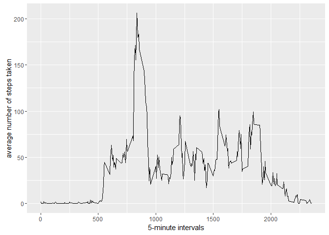

# Reproducible Research: Peer Assessment 1


## Loading and preprocessing the data

```r
library(ggplot2)
```

```
## Warning: package 'ggplot2' was built under R version 3.3.1
```

```r
library(plyr)
library(reshape2)
library(xtable)
```

```
## Warning: package 'xtable' was built under R version 3.3.1
```

```r
setwd("C:/DataScience/Reproducible Research/W2 Project/RepData_PeerAssessment1/");

activityFile <- "activity.zip"
activityData <- read.csv(unz(activityFile, "activity.csv"), na.strings = "NA")

#fixed date type, only realized this error later.
activityData$date <- as.Date(as.character(activityData$date))
```


## What is mean total number of steps taken per day?

### histogram of the steps 

```r
steps <- tapply(activityData$steps, activityData$date, FUN = sum, na.rm = TRUE)
qplot(steps, binwidth = 1000, xlab = "total number of steps taken each day") 
```

<!-- -->

### Mean Steps per date

```r
stepsperDay <-aggregate(steps ~ date, data=activityData, sum, na.action = na.omit)
colnames(stepsperDay) <-c("date","mean steps")

mean(stepsperDay$`mean steps`)
```

[1] 10766.19

## What is the average daily activity pattern?
### Average Activity per day

```r
ave<- aggregate(x = list(steps = activityData$steps), by = list(interval = activityData$interval), 
    FUN = mean, na.rm = TRUE)
ggplot(data = ave, aes(x = interval, y = steps)) + geom_line() + xlab("5-minute intervals") + 
    ylab("average number of steps taken")
```

<!-- -->

### The average daily Activity is 206.1698

```r
ave[which.max(ave$steps ),]
```

```
##     interval    steps
## 104      835 206.1698
```

## Imputing missing values

###There are quite a few missing=NA values. We need to replace those missing values with the mean steps in the associate interval. I am using the mean imputing method reference here [https://en.wikipedia.org/wiki/Imputation_(statistics)]


```r
missingSteps<-is.na(activityData$steps)

table(missingSteps)
```

```
## missingSteps
## FALSE  TRUE 
## 15264  2304
```


```r
fill_value <- function(steps, interval) {
    filled <- NA
    if (!is.na(steps))
        filled <- c(steps)
    else
        filled <- (ave[ave$interval==interval, "steps"])
    return(filled)
}

activityFilled <- activityData
activityFilled$steps <- mapply(fill_value, activityFilled$steps, activityFilled$interval)
```

###Lets plot this filled dataset


```r
totalNumSteps <- tapply(activityFilled$steps, activityFilled$date,FUN=sum)
qplot(totalNumSteps, binwidth = 1000, xlab = "Total number of steps per day")
```

<!-- -->

## Are there differences in activity patterns between weekdays and weekends?

###Seperate the data between weekend and weekday

```r
dayofWeek <- ifelse(weekdays(activityFilled$date)=="Saturday" | weekdays(activityFilled$date)=="Sunday","weekend","weekday")
activityFilled$day <- as.factor(dayofWeek)

weekdayActivities<- subset(activityFilled,day == "weekday")
wdActivity <- ddply(weekdayActivities, c("interval","day"), summarise, avgSteps=mean(steps))

weekendActivities<- subset(activityFilled,day == "weekend")

weActivity <- ddply(weekendActivities, c("interval","day"), summarise, avgSteps=mean(steps))
```

### Weekday vs Weekend Plot
As you will see in the graphs below that there are more activities on the weekends then the weekdays.

```r
par(mfrow=c(1,2))
plot(wdActivity$interval, wdActivity$avgSteps,type = "h", col = "red", pch=16, lwd = 1,main="Average activities on a Weekday", xlab="24 Hours at 5-Min interval", ylab="Number of Steps" )

plot(weActivity$interval, weActivity$avgSteps,type = "h", col = "blue", lwd = 1,main="Average activities on a Weekend",  xlab="24 Hours at 5-Min interval", ylab="Number of Steps")
```

<!-- -->
